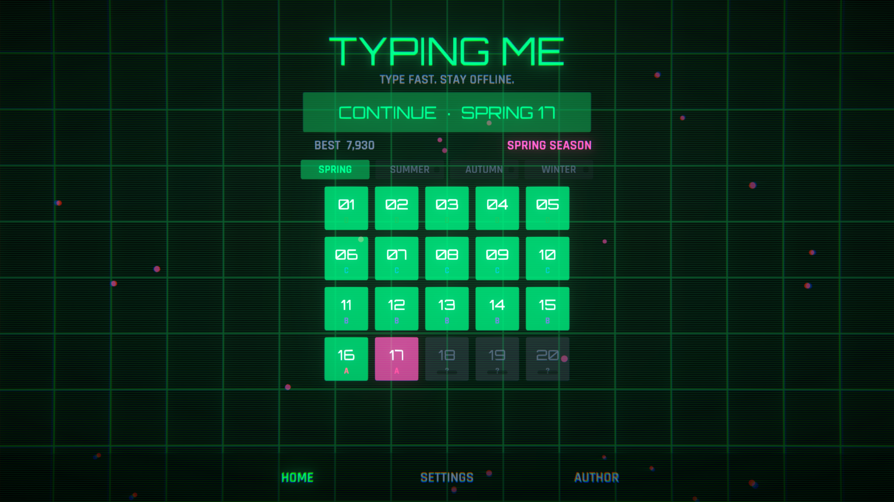
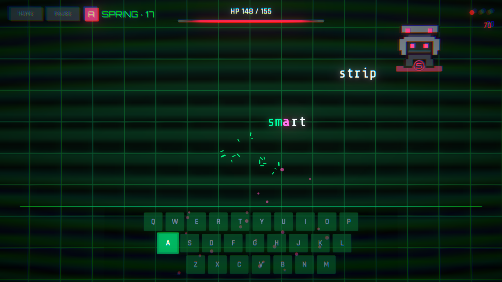
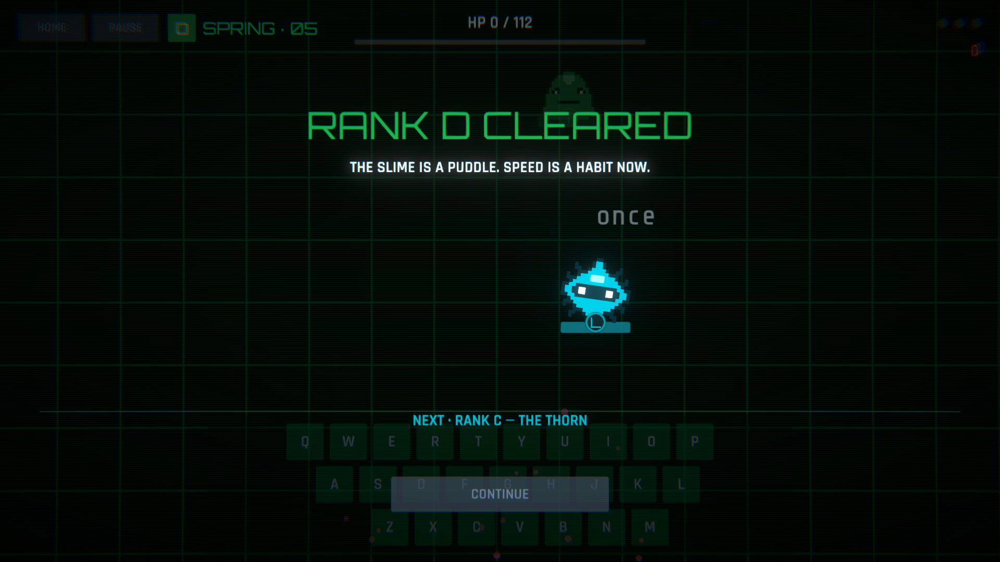
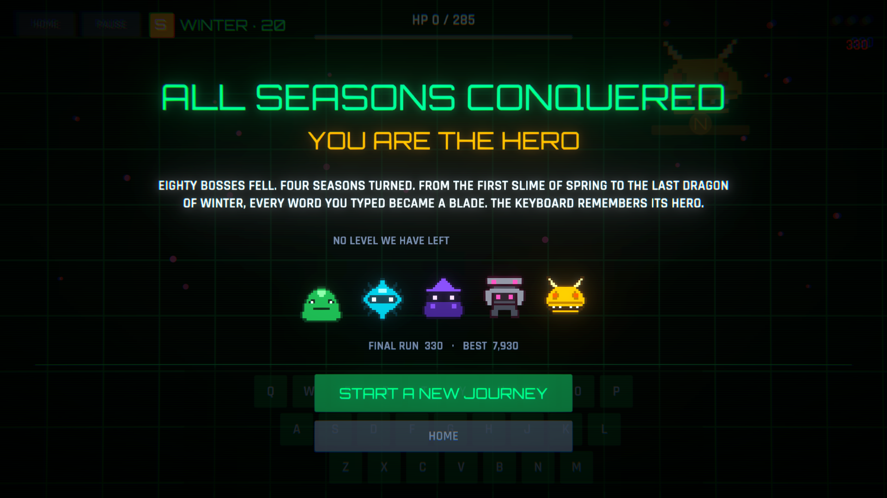

# ⌨️ Typing Me

**A neon typing-action game.** Words rain from pixel-art bosses — type them before they hit the
line. 80 levels, 4 seasons, 5 bosses, and a keyboard that turns into a weapon.


|  |  |
|---|---|
|  |  |
|  |  |

---

## 🎮 What is Typing Me?

Every level is a boss fight. A creature patrols the top of the screen and hurls English words down
at you; **every word you type is damage**. Words containing the boss's glowing **sigil letter** hit
×1.5 harder — chase them. Let three words cross the bottom line and the run ends.

The campaign is **80 levels across four seasons** — Spring, Summer, Autumn, Winter. Each season is
five rank blocks (`D → C → B → A`, then the `S` season boss), and each season **owns the whole
look and feel of the game**: its palette, its weather, even how words fall. The only way to change
the theme is to beat the season.

### The bosses

| Rank | Creature | Fights like |
|---|---|---|
| `D` | 🟢 **The Slime** | Slow crawl, squash-and-stretch. Word bursts only — the warm-up. |
| `C` | 🔵 **The Thorn** | Wobble-spinning blade. Adds **Speed Surge** — everything falls faster. |
| `B` | 🟣 **The Witch** | Floaty swoops. Adds **Word Veil** — unread letters become `#`. |
| `A` | 🩷 **The Golem** | Heavy march. Fires **paired attacks**. |
| `S` | 🟡 **The Dragon** | Fastest sweep on the board. Everything at once — and it **enrages** below 30% HP. |

Every attack is telegraphed under the boss before it lands. Learn the tells.

### The seasons

| Season | Palette | Weather | The wind on words |
|---|---|---|---|
| 🌸 Spring | Neon leaf-green & blossom pink | Drifting petals | Clean vertical fall |
| ☀️ Summer | Amber gold & pool cyan | Rising heat embers | A light shimmer |
| 🍂 Autumn | Burnt orange & harvest gold | Tumbling leaves | Hard sideways gusts |
| ❄️ Winter | Ice cyan & aurora violet | Falling snow | Slow, floaty drift |

Beat a season boss and the entire game recolours to the next season **live, mid-celebration**.
Clear a rank block and you get a rank-up interstitial with a **live teaser of the next boss** — the
actual creature you're about to fight, sigil and all. Beat level 80 and the finale crowns you:
a word-by-word tribute, the five defeated creatures taking a bow, and the choice to start a brand
new journey.

### Smart typing

- The game locks onto the lowest word matching your first keystroke — but **your typing overrules
  its guess**. With `taste` and `trip` on screen, typing `t` then `r` re-routes the lock to `trip`
  instantly, progress carried over. No wasted keystrokes.
- Works with **any keyboard layout** (QWERTY, AZERTY, …) — the game listens to the letters you
  actually type, not physical key positions.
- A wrong key is feedback, never a punishment. Only words crossing the line count against you.

---

## ⬇️ Download & install

Grab the latest build from **[Releases](../../releases/latest)**.

### Windows (10/11, 64-bit)

1. Download **`TypingMe-Windows-x64.zip`**.
2. Extract the zip anywhere (right-click → *Extract All…*).
3. Run **`TypingMe.exe`**.
4. If SmartScreen appears (the build is unsigned): click **More info → Run anyway**.

### macOS (11+, Intel & Apple Silicon)

1. Download **`TypingMe-macOS.zip`**.
2. Double-click the zip; drag **`TypingMe.app`** wherever you like (e.g. Applications).
3. First launch (the build is unsigned): **right-click the app → Open → Open**.
   If macOS still refuses, clear the quarantine flag once:

   ```bash
   xattr -cr /path/to/TypingMe.app
   ```

No installer, no account, no internet needed — the game is fully offline. Progress saves
automatically:

- Windows: `%USERPROFILE%\AppData\LocalLow\DefaultCompany\Typing Me\`
- macOS: `~/Library/Application Support/DefaultCompany/Typing Me/`

---

## ⌨️ How to play

| Action | Key |
|---|---|
| Attack | Just type the falling words |
| Pause / resume | `Esc` or the PAUSE button |
| Skip splash | Any key |

**Rules of the run:** the boss's HP bar is the level. Typed letters light up on the word and on the
on-screen keyboard; finishing a word deals its length as damage. Sigil words (the letter shown on
the boss's badge) deal and score ×1.5. Three missed words end the run — a mistyped key never does.

**Score:** longer words and unbroken combos multiply your points; sigil words pay extra.

---

## 🔊 100% procedural, 100% offline

- The synthwave soundtrack and every sound effect are **synthesised at runtime** — no audio files.
- Backgrounds, UI, gradients and effects are generated from code; the five bosses are hand-made
  pixel art.
- No ads, no tracking, no network calls. Your keyboard, the words, and you.

---

## 🛠 Building from source

You need **Unity 6000.5.8f1** with macOS and/or Windows (Mono) build support.

```text
1. Clone the repo and open the folder in Unity Hub.
2. Menu: Typing Me → Rebuild Project Assets   (regenerates every scene, prefab and asset from code)
3. Menu: Typing Me → Build → macOS / Windows x64
```

Everything except the boss art is generated from code, validated by `Typing Me → Validate Generated
Assets`, and covered by **46 tests** (EditMode + PlayMode). The full developer guide — architecture,
campaign internals, tuning-asset caveats, headless commands — lives in
**[docs/DEVELOPMENT.md](docs/DEVELOPMENT.md)**.

> ⚠️ The bundled word list is licensed for personal/educational use — replace it before any
> commercial release. Details in [docs/DEVELOPMENT.md](docs/DEVELOPMENT.md).

---

## 👤 Author

**Rahmatillokh Dev**

[](https://www.youtube.com/@rahmatillokh)
[](https://github.com/rahmatillokh)
[](https://t.me/rahmatillokh_web)
[](https://www.instagram.com/rahmatillo.dev)

If Typing Me made your fingers faster, you can **[support the project](https://tirikchilik.uz/rahmatillokh)** 💛
